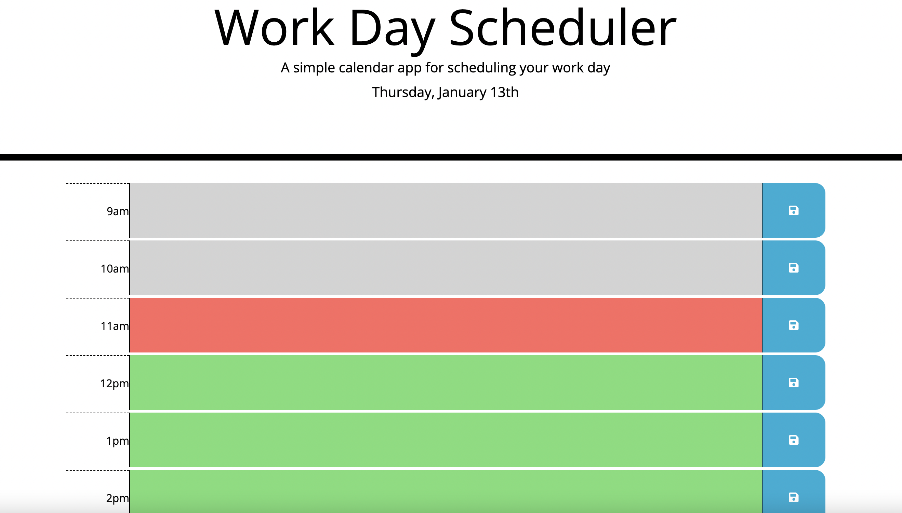

# day-planner

## Description

- The aim of this project was to create a work day planner that showed the current date and then timeblocks for each hour of regular business hours.

- The hours of the day would change color depending on whether they were in the past, present or future. Once the time has past an hour in the day that hour can no longer be edited.

- The data entered into the timeblock is saved to local storage once the save icon is clicked and will stay in that timeblock even if page is refreshed or if page is closed and then reopened.

- The data will clear at the end of each day and reset once a new day starts.

- The page has an interval set to check every 10 minutes to see if color needs to change on time of day.

## Day-Planner

- The day planner can be found at this [live site](https://danlawrence91.github.io/day-planner/) 

- A screenshot of the planner with different colors for what hour of day it is and todays date is shown:

## Future features

- Further pages could be added to this so you can go to a day in the future, or it can be edited so that if more pages are added, instead of clearing the data, this data is saved so that it can be recalled at a later date.

- Color coding could also be added for items depending on what type of event it is - be it work, leisure etc.